# TaskHub

<p align="center">
  
</p>

<p align="center">
  <strong>A beautiful, feature-rich task management app for personal and team productivity</strong>
</p>

<p align="center">
  <a href="#features">Features</a> •
  <a href="#screenshots">Screenshots</a> •
  <a href="#tech-stack">Tech Stack</a> •
  <a href="#architecture">Architecture</a> •
  <a href="#getting-started">Getting Started</a> •
  <a href="#project-structure">Project Structure</a>
</p>

---

## Overview

TaskHub is a modern, cross-platform task management application built with Flutter. It enables users to organize their personal tasks and collaborate with teams on projects. With a beautiful dark/light theme, smooth animations, and real-time synchronization, TaskHub provides a delightful productivity experience.

## Features

### Core Features

- **Task Management**

  - Create, edit, and delete tasks
  - Set priorities (Low, Medium, High, Urgent)
  - Track status (To Do, In Progress, Completed, Cancelled)
  - Due date scheduling with overdue detection
  - Recurring tasks support
  - Swipe-to-delete with confirmation
- **Project Collaboration**

  - Create and manage projects
  - Role-based access control (Admin, Editor, Viewer)
  - Invite team members
  - Track project progress with visual indicators
  - Color-coded project organization
- **Calendar View**

  - Visual calendar with task scheduling
  - Day/week/month views
  - Task due date visualization
- **Dashboard**

  - Overview statistics
  - Today's tasks at a glance
  - Recent projects
  - Quick actions
- **Notifications**

  - Task reminders
  - Project updates
  - Collaboration notifications

### Authentication

- Email/Password authentication
- Google OAuth sign-in
- Magic link authentication
- Password reset flow
- Email verification

## Screenshots

### Light Mode

|                  Home                  |                   Tasks                   |                    Projects                    |                    Calendar                    |
| :-------------------------------------: | :---------------------------------------: | :---------------------------------------------: | :---------------------------------------------: |
| 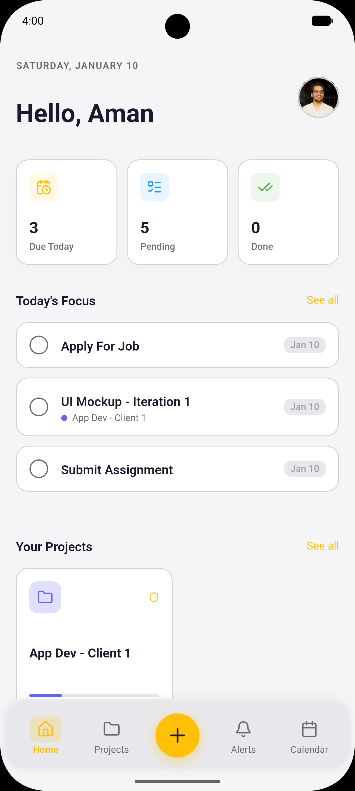 | 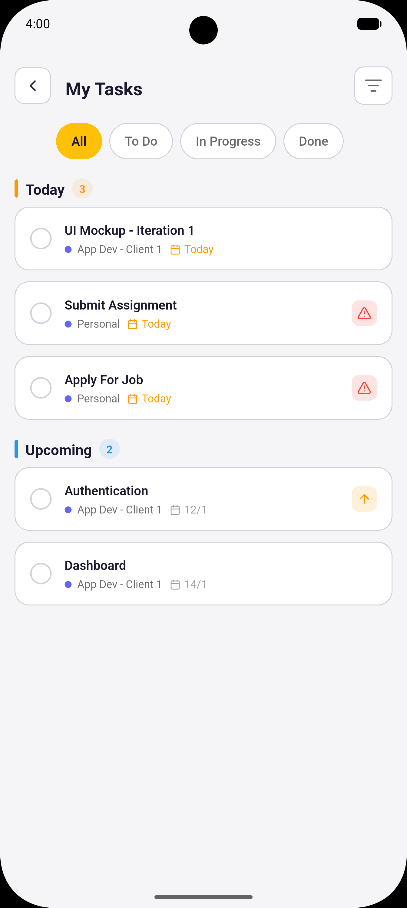 | 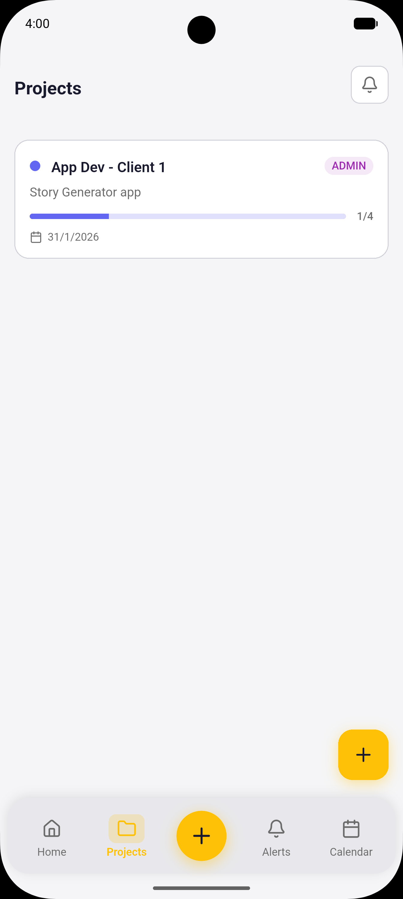 | 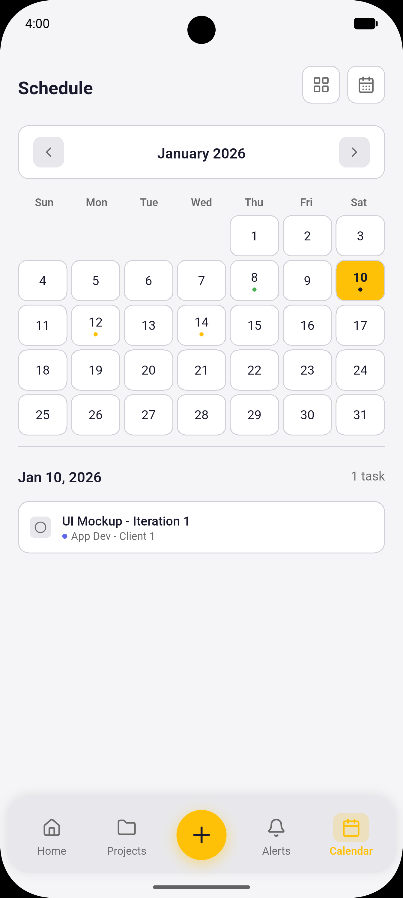 |

### Dark Mode

|                 Home                 |                  Tasks                  |                   Projects                   |                   Calendar                   |
| :-----------------------------------: | :-------------------------------------: | :-------------------------------------------: | :-------------------------------------------: |
| 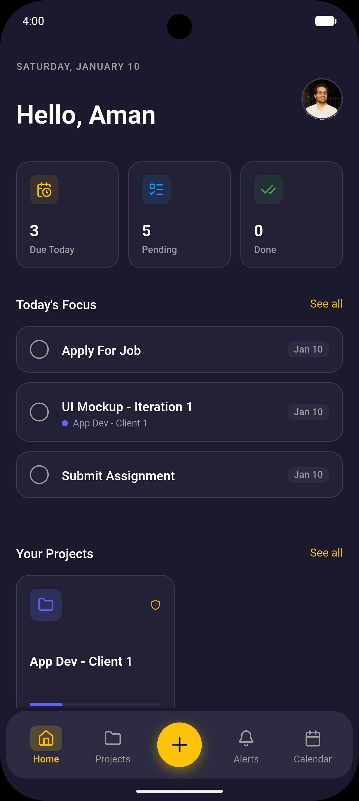 | 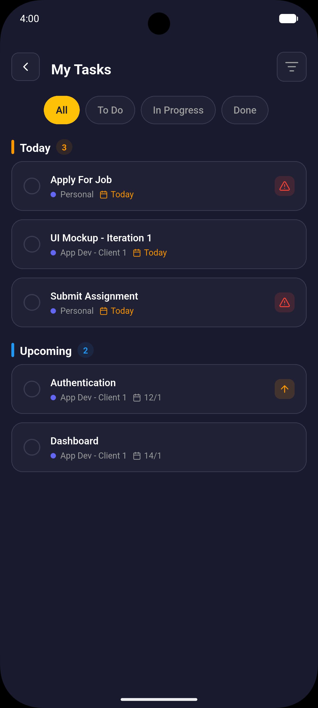 | 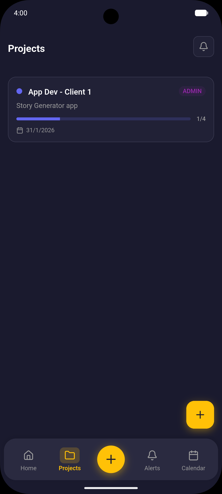 | 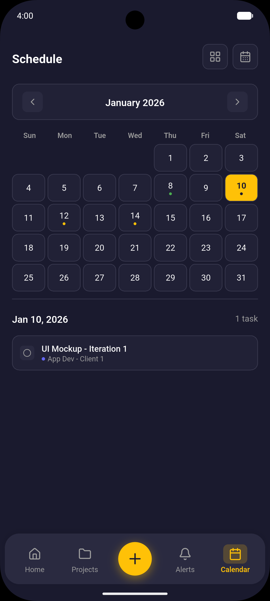 |

### Authentication

|             Login             |              Sign Up              |
| :---------------------------: | :-------------------------------: |
| 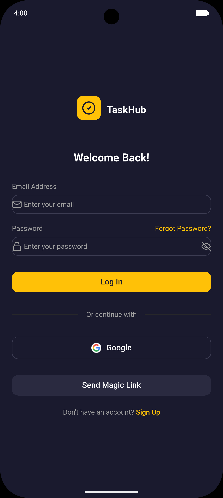 | 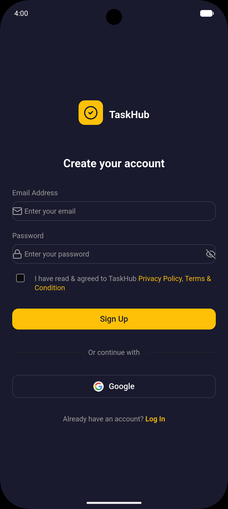 |

### Task Details

|                Create Task                |                Task Detail                |
| :---------------------------------------: | :----------------------------------------: |
| 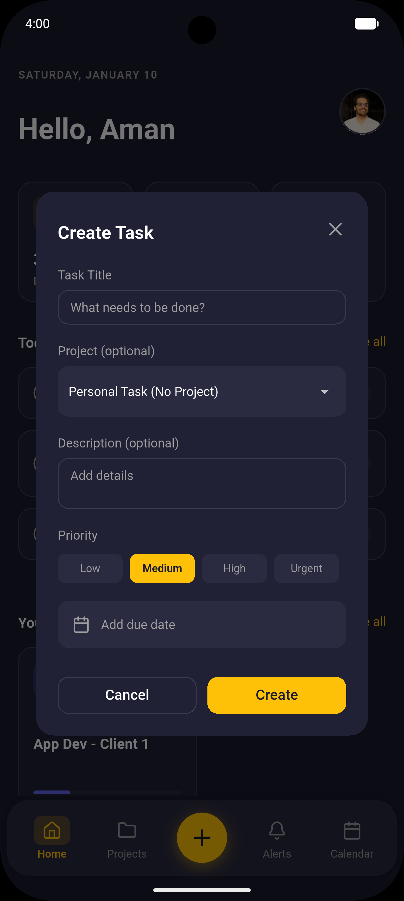 | 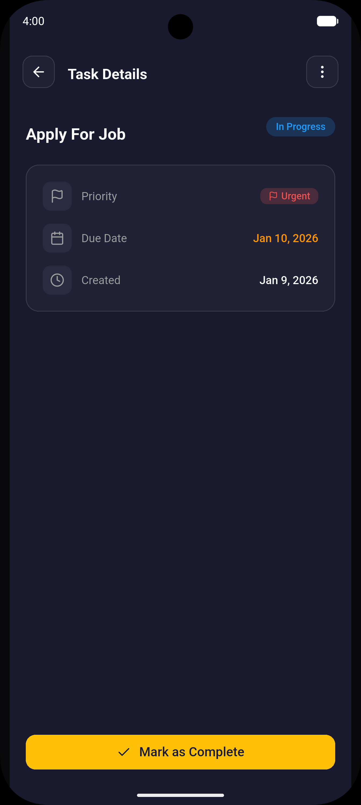 |

## Tech Stack

### Frontend

- **Flutter** - Cross-platform UI framework
- **Dart** - Programming language
- **flutter_bloc** - State management with BLoC pattern
- **freezed** - Immutable data classes with unions
- **injectable** + **get_it** - Dependency injection

### Backend & Database

- **Supabase** - Backend-as-a-Service
  - PostgreSQL database
  - Real-time subscriptions
  - Row Level Security (RLS)
  - Authentication

### Navigation

- **go_router** - Declarative routing with type-safe routes
- **go_router_builder** - Code generation for routes

### UI Framework

- **forui** - Modern UI component library
- **Material Design 3** - Design system

### Other Dependencies

- **google_sign_in** - Google OAuth integration
- **app_links** - Deep link handling
- **shared_preferences** - Local storage
- **rxdart** - Reactive extensions for Dart
- **intl** - Internationalization

## Architecture

TaskHub follows **Clean Architecture** principles with a **feature-based structure**:

```
┌─────────────────────────────────────────────────────────────┐
│                      Presentation Layer                     │
│  ┌─────────────┐  ┌─────────────┐  ┌─────────────────────┐  │
│  │   Pages     │  │   Widgets   │  │   BLoC (Events/     │  │
│  │             │  │             │  │   States)           │  │
│  └─────────────┘  └─────────────┘  └─────────────────────┘  │
└─────────────────────────────────────────────────────────────┘
                              │
                              ▼
┌─────────────────────────────────────────────────────────────┐
│                       Domain Layer                          │
│  ┌─────────────────────┐  ┌───────────────────────────────┐ │
│  │   Entities          │  │   Repository Interfaces       │ │
│  │   (Freezed models)  │  │   (Abstract contracts)        │ │
│  └─────────────────────┘  └───────────────────────────────┘ │
└─────────────────────────────────────────────────────────────┘
                              │
                              ▼
┌─────────────────────────────────────────────────────────────┐
│                        Data Layer                           │
│  ┌───────────────────────────────────────────────────────┐  │
│  │   Repository Implementations (Supabase integration)   │  │
│  └───────────────────────────────────────────────────────┘  │
└─────────────────────────────────────────────────────────────┘
```

### Key Patterns

**Error Handling** - Named record return types:

```dart
Future<({AppUser? user, AuthFailure? failure})> signIn(String email, String password);
```

**State Management** - BLoC with Freezed:

```dart
@freezed
class TaskEvent with _$TaskEvent {
  const factory TaskEvent.loadMyTasks() = LoadMyTasks;
  const factory TaskEvent.completeTask(String taskId) = CompleteTask;
}
```

**Dependency Injection** - Injectable:

```dart
@injectable
class TaskBloc extends Bloc<TaskEvent, TaskState> { ... }

@LazySingleton(as: TaskRepository)
class TaskRepositoryImpl implements TaskRepository { ... }
```

**Type-safe Navigation** - GoRouter:

```dart
@TypedGoRoute<TaskDetailRoute>(path: '/tasks/:taskId')
class TaskDetailRoute extends GoRouteData { ... }

// Usage
TaskDetailRoute(taskId: '123').push(context);
```

## Getting Started

### Prerequisites

- Flutter SDK 3.38 or higher
- A Supabase project (free tier available)
- (Optional) Google Cloud project for OAuth

### Installation

1. **Clone the repository**

   ```bash
   git clone https://github.com/AmanSikarwar/taskhub.git
   cd taskhub
   ```

2. **Install dependencies**

   ```bash
   flutter pub get
   ```

3. **Set up environment variables**

   Create a `.env` file in the project root:

   ```env
   SUPABASE_URL=your_supabase_url
   SUPABASE_ANON_KEY=your_anon_key
   GOOGLE_WEB_CLIENT_ID=your_web_client_id
   GOOGLE_IOS_CLIENT_ID=your_ios_client_id
   ```

4. **Run code generation**

   ```bash
   dart run build_runner build --delete-conflicting-outputs
   ```

5. **Run the app**

   ```bash
   flutter run
   ```

### Supabase Setup

Follow these steps to set up your Supabase backend:

#### 1. Create a Supabase Project

1. Go to [Supabase Dashboard](https://supabase.com/dashboard)
2. Click **New Project**
3. Enter a project name (e.g., "TaskHub")
4. Set a secure database password (save this!)
5. Select your preferred region
6. Click **Create new project** and wait for initialization

#### 2. Run the Database Setup Script

The database schema includes 5 tables with Row Level Security policies:

1. In your Supabase dashboard, go to **SQL Editor** (left sidebar)
2. Click **New query**
3. Open `supabase/setup.sql` from this repository
4. Copy the entire contents and paste it into the SQL Editor
5. Click **Run** (or press Cmd/Ctrl + Enter)
6. You should see "Success. No rows returned"

The script creates:

- **Tables**: `profiles`, `projects`, `project_members`, `tasks`, `notifications`
- **Enums**: `task_status`, `task_priority`, `project_role`, `notification_type`
- **Functions**: 12 helper functions and triggers for automation
- **Security**: Row Level Security (RLS) policies for all tables
- **Realtime**: Enabled for all tables for live updates

#### 3. Get Your API Keys

1. In Supabase dashboard, go to **Project Settings** > **API**
2. Copy the following:
   - **Project URL** (e.g., `https://xxxx.supabase.co`)
   - **anon public** key (under Project API keys)

#### 4. Configure Authentication Providers

**Email/Password** (enabled by default) - No additional setup needed.

**Google OAuth** (optional):

1. Go to [Google Cloud Console](https://console.cloud.google.com)
2. Create a new project or select an existing one
3. Go to **APIs & Services** > **Credentials**
4. Click **Create Credentials** > **OAuth client ID**
5. For Web application:
   - Add `https://YOUR_PROJECT_ID.supabase.co/auth/v1/callback` to Authorized redirect URIs
6. For iOS:
   - Select "iOS" as application type
   - Enter your bundle ID (default: `com.example.taskhub`)
7. Copy the Client IDs
8. In Supabase dashboard:
   - Go to **Authentication** > **Providers**
   - Enable **Google**
   - Paste your Client ID and Client Secret
   - Save

**Magic Link** (optional) - Enable in **Authentication** > **Providers** > **Email**

#### 5. Configure Deep Links

**iOS** - Already configured in `ios/Runner/Info.plist` with scheme `io.taskhub://auth-callback`

**Android** - Add to `android/app/src/main/AndroidManifest.xml` inside the `<activity>` tag:

```xml
<intent-filter>
    <action android:name="android.intent.action.VIEW" />
    <category android:name="android.intent.category.DEFAULT" />
    <category android:name="android.intent.category.BROWSABLE" />
    <data android:scheme="io.taskhub" android:host="auth-callback" />
</intent-filter>
```

#### Database Schema Overview

```
┌─────────────┐     ┌──────────────────┐     ┌─────────────┐
│  profiles   │────<│ project_members  │>────│  projects   │
│  (users)    │     │  (junction)      │     │             │
└─────────────┘     └──────────────────┘     └──────┬──────┘
       │                                            │
       │                                            │
       │            ┌─────────────────┐             │
       └───────────>│     tasks       │<────────────┘
                    │                 │
                    └─────────────────┘
                            │
       ┌────────────────────┘
       │
       v
┌─────────────────┐
│  notifications  │
└─────────────────┘
```

For detailed setup instructions and troubleshooting, see [supabase/README.md](supabase/README.md).

## Project Structure

```text
lib/
├── core/                           # Shared infrastructure
│   ├── di/                         # Dependency injection setup
│   │   ├── injection.dart          # GetIt configuration
│   │   └── register_module.dart    # Module registrations
│   │
│   ├── router/                     # Navigation
│   │   ├── app_router.dart         # Route definitions
│   │   └── app_router.g.dart       # Generated routes
│   │
│   ├── theme/                      # Theming
│   │   └── app_theme.dart          # Colors, typography, themes
│   │
│   ├── widgets/                    # Reusable widgets
│   │   ├── animated_list_item.dart # Animation utilities
│   │   ├── app_widgets.dart        # Common UI components
│   │   └── app_bottom_sheets.dart  # Bottom sheet helpers
│   │
│   ├── utils/                      # Utilities
│   │   ├── app_utils.dart          # Helper functions
│   │   └── error_messages.dart     # Error message formatting
│   │
│   ├── env/                        # Environment configuration
│   │   └── env.dart                # Envied environment variables
│   │
│   ├── deep_link/                  # Deep link handling
│   │   └── deep_link_handler.dart  # Auth callback handling
│   │
│   └── error/                      # Error types
│       └── failures.dart           # Failure definitions
│
├── features/                       # Feature modules
│   │
│   ├── auth/                       # Authentication
│   │   ├── data/
│   │   │   └── repositories/
│   │   │       └── auth_repository_impl.dart
│   │   ├── domain/
│   │   │   ├── entities/
│   │   │   │   ├── app_user.dart
│   │   │   │   └── auth_failure.dart
│   │   │   └── repositories/
│   │   │       └── auth_repository.dart
│   │   └── presentation/
│   │       ├── bloc/
│   │       │   ├── auth_bloc.dart
│   │       │   ├── auth_event.dart
│   │       │   └── auth_state.dart
│   │       ├── pages/
│   │       │   ├── login_page.dart
│   │       │   ├── signup_page.dart
│   │       │   ├── forgot_password_page.dart
│   │       │   ├── magic_link_page.dart
│   │       │   ├── update_password_page.dart
│   │       │   └── email_verification_page.dart
│   │       └── widgets/
│   │           └── auth_wrapper.dart
│   │
│   ├── tasks/                      # Task management
│   │   ├── data/
│   │   │   └── repositories/
│   │   │       └── task_repository_impl.dart
│   │   ├── domain/
│   │   │   ├── entities/
│   │   │   │   ├── task.dart
│   │   │   │   └── task_failure.dart
│   │   │   └── repositories/
│   │   │       └── task_repository.dart
│   │   └── presentation/
│   │       ├── bloc/
│   │       │   └── task_bloc.dart
│   │       ├── pages/
│   │       │   ├── my_tasks_page.dart
│   │       │   └── task_detail_page.dart
│   │       └── widgets/
│   │           ├── task_tile.dart
│   │           ├── task_card.dart
│   │           ├── tasks_listview.dart
│   │           └── create_task_dialog.dart
│   │
│   ├── projects/                   # Project management
│   │   ├── data/
│   │   ├── domain/
│   │   └── presentation/
│   │
│   ├── calendar/                   # Calendar view
│   │   └── presentation/
│   │       └── pages/
│   │           └── calendar_page.dart
│   │
│   ├── home/                       # Dashboard
│   │   └── presentation/
│   │       ├── pages/
│   │       │   └── home_page.dart
│   │       └── widgets/
│   │           ├── main_shell.dart
│   │           ├── dashboard_header.dart
│   │           ├── stats_overview.dart
│   │           ├── today_tasks_section.dart
│   │           └── recent_project_section.dart
│   │
│   ├── notifications/              # Notifications
│   │   └── presentation/
│   │
│   ├── profile/                    # User profile
│   │   └── presentation/
│   │
│   └── onboarding/                 # Onboarding flow
│       └── presentation/
│           └── pages/
│               ├── splash_page.dart
│               └── onboarding_page.dart
│
└── main.dart                       # App entry point
```

## Configuration

### Environment Variables

| Variable                 | Description                   | Required |
| ------------------------ | ----------------------------- | -------- |
| `SUPABASE_URL`         | Your Supabase project URL     | Yes      |
| `SUPABASE_ANON_KEY`    | Supabase anonymous/public key | Yes      |
| `GOOGLE_WEB_CLIENT_ID` | Google OAuth web client ID    | No       |
| `GOOGLE_IOS_CLIENT_ID` | Google OAuth iOS client ID    | No       |

## License

This project is licensed under the MIT License - see the [LICENSE](LICENSE) file for details.
